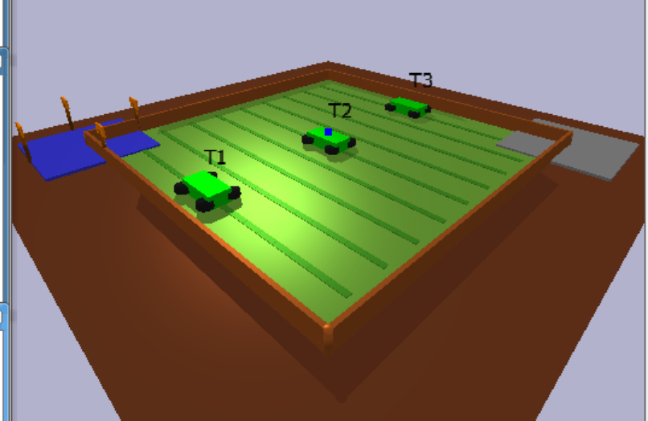

# 🚜 Agrika: Smart Tractor Fleet Management using Reinforcement Learning
This project develops Agrika, a smart tractor monitoring system designed for smallholder farmers in Rwanda who use four-wheel tractors. The system addresses unexpected equipment breakdowns, poor maintenance practices, and limited access to technical support by implementing a reinforcement learning (RL) environment to optimise tractor fleet management. Using a custom Gym environment, four RL algorithms (DQN, REINFORCE, PPO, A2C) are trained to minimise downtime and maintenance costs while maximising productivity. The approach simulates a 7-day week, balancing tractor operations, maintenance, and rest under varying weather and demand conditions.





 **[Project Demo Video](https://docs.google.com/document/d/1Fli-sQ-m-vozlKXEKDls4BHIMEFLYi7O8SJGh8Rogio/edit?usp=sharing)**  
 **GitHub Repo**: https://github.com/Joh-Ishimwe/josiane_ishimwe_rl_summative

---

## Project Overview

Agrika is a custom Gymnasium environment built with PyBullet for realistic 3D simulation. It trains and compares four RL algorithms:

- Deep Q-Network (DQN)
- REINFORCE (Policy Gradient)
- Proximal Policy Optimization (PPO)
- Advantage Actor Critic (A2C)

The objective is to **maximize productivity**, **minimize breakdowns**, and **reduce maintenance costs** in a dynamic environment.

---

## 🌾 Environment Details

###  Agent

- Controls 3 four-wheel tractors.
- Attributes: Hours used, condition (0–100), days since last maintenance.
- Affected by weather (rainy/dry) and work demand (low/moderate/high).

###  Action Space

- Discrete action space of 27 combinations.
- Each tractor can:  
  `0 = Rest`, `1 = Operate`, `2 = Maintain`  
  Example: `(0, 2, 1)` means T1 rests, T2 is maintained, T3 works.

###  State Space

13-dimensional vector:
- 9 for tractor attributes
- 2 for weather (today and tomorrow)
- 1 for the current day
- 1 for work demand

###  Reward Function

Reward = Productivity - Maintenance Penalty - Breakdown Penalty


- Positive reward for productivity (higher on dry days).
- Penalty for maintenance (-0.5).
- Penalty for breakdowns (based on probability).

###  Visualization

- Built with **PyBullet**
- 3D environment: tractors, fields, weather effects, and zones

---

##  Implemented RL Algorithms

### ✅ DQN
- 3-layer neural network
- Experience replay buffer: 10,000
- Epsilon-greedy strategy
- Target network updates

### ✅ REINFORCE
- Policy gradient method with dropout and entropy regularization
- Curriculum learning to improve adaptability

### ✅ PPO
- Clipped objective
- Parallelized training (vectorized environments)
- Best performance overall

### ✅ A2C
- Combined policy/value networks
- Advantage estimation for lower variance

---

##  Hyperparameters Summary

| Algorithm   | Learning Rate | Gamma | Batch Size | Notable Features             |
|------------|---------------|--------|------------|------------------------------|
| DQN        | 0.0005        | 0.99   | 64         | Experience Replay            |
| PPO        | 0.0003        | 0.99   | 128        | Clipped Objective            |
| A2C        | 0.0003        | 0.99   | 128        | N-Step = 2048                |
| REINFORCE  | 0.0002        | 0.99   | 128        | Entropy Coefficient = 0.1    |

---

##  Performance Metrics

| Metric               | PPO      | A2C      | DQN      | REINFORCE |
|----------------------|----------|----------|----------|-----------|
| Cumulative Reward     | ✅ ~240  | ✅ ~230  | ~150     | ~170      |
| Training Stability    | ✅ Stable| ✅ Stable| Fluctuate| Increase   |
| Episodes to Converge  | ~1,000   | ~1,000   | ~1,500   | ~2,000     |
| Generalization        | ✅ Best  | Good     | Poor     | Moderate   |

---

##  Key Insights

- **PPO** had the best overall performance in productivity and generalization.
- **A2C** was stable and competitive.
- **DQN** struggled with large action space.
- **REINFORCE** had high variance, requiring careful tuning.

---

##  How to Run the Project

1. Clone the repo:

```bash
git clone https://github.com/Joh-Ishimwe/josiane_ishimwe_rl_summative.git
cd josiane_ishimwe_rl_summative
```
2. Install dependencies:
```
pip install -r requirements.txt
```
3. Run training

## Project Structure
```
josiane_ishimwe_rl_summative/
├── environment/          # Custom environment implementation
├── training/            # Training scripts for all algorithms
├── models/              # Saved model files
├── logs/                # Training logs and tensorboard data
└── main.py              # Main entry point
```

## Author
Josiane Ishimwe - Software Engineering Student, African Leadership University